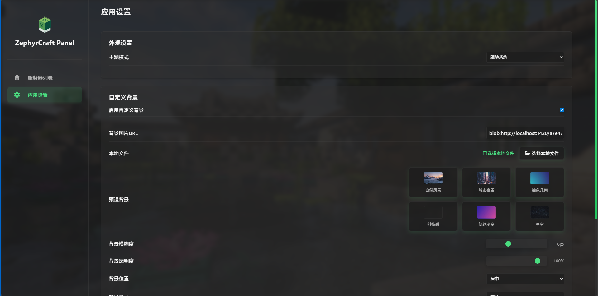
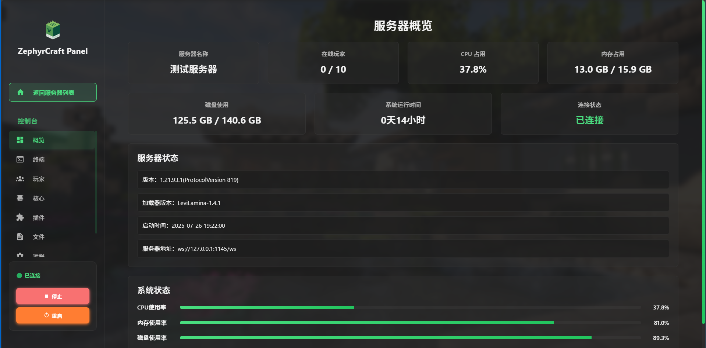
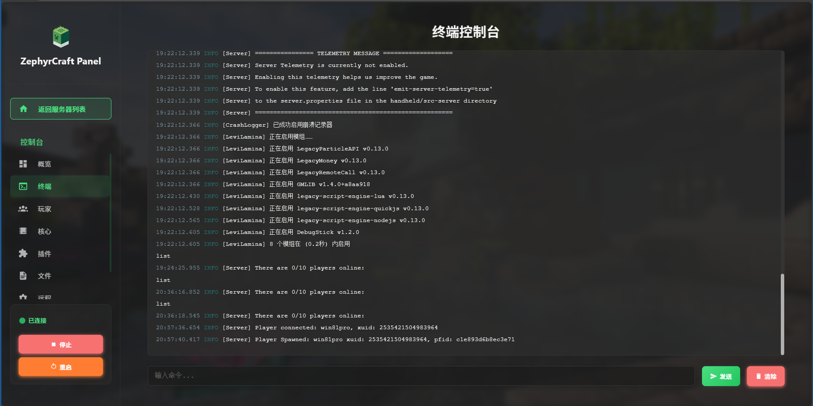
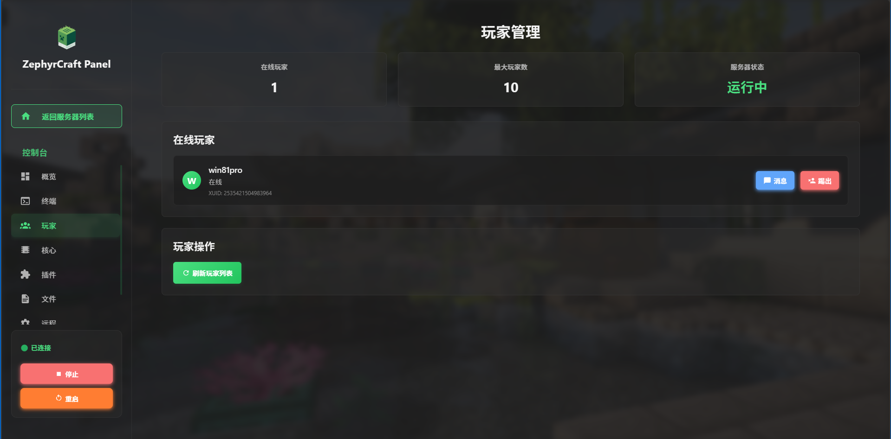
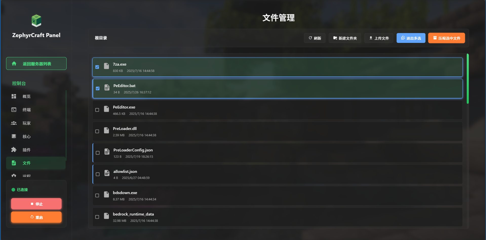
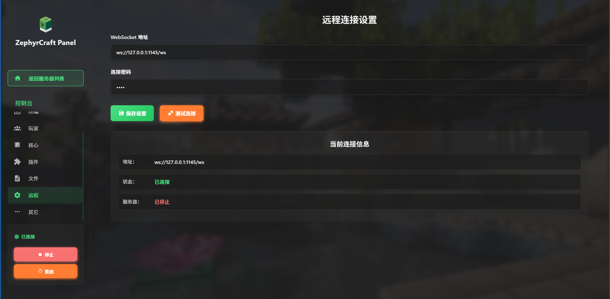

# ZephyrCraft Panel 2 

### 🍃轻若微风

⚠前排提示：此项目是一个新人主导开发的，代码中可能包括但不限于：

1.令人血压升高的功能实现方法

2.毫无章法格式的代码

### 🌟项目展示
> 📷截图展示

  
点击展开  ⚠多图预警

  
  
  
  
  
  
  

### ✅To-Do

- [ ] ？

### 🗂️Organization仓库结构说明

仓库|作用|主要使用的编程语言
:---:|:---:|:---:
本仓库|项目的主仓库，存放开发者文档和发布版本（Releases）|-
[Client](https://github.com/ZCP2-Dev/Client)|用于进行前端（客户端）项目的相关开发|  
[Server-Java](https://github.com/ZCP2-Dev/Server-Java)|用于进行Java版后端（服务端）项目的相关开发| 
[Server-BDS](https://github.com/ZCP2-Dev/Server-BDS)|用于进行Java版后端（服务端）项目的相关开发| 

### ▶️如何使用！
目前项目提供了[中文文档](https://kdocs.cn/l/chGwHOa4eBil)，欢迎阅读

### 🏆Credits
此项目中使用了一些其他的开源项目成果，在下方已标出以表示感谢：

[https://github.com/gorilla/websocket](https://github.com/gorilla/websocket) 用于在golang中实现websocket链接操作

[https://github.com/XY0797/pty-proxy](https://github.com/XY0797/pty-proxy) 用于创建伪终端以实现输出操作

另外，感谢以下项目为我们提供支持：

[Uniteban](http://uniteban.xyz:19132) 提供云黑相关接口支持
