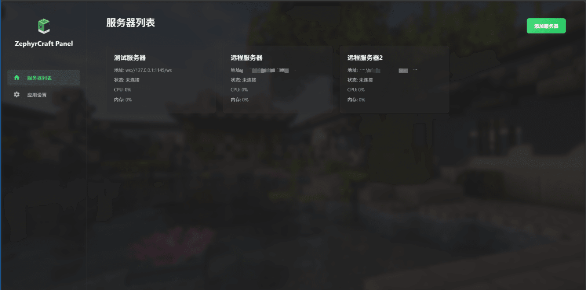

# ZephyrCraft Panel 2 

### 🍃轻若微风

⚠前排提示：此项目是一个新人主导开发的，代码中可能包括但不限于：

1.令人血压升高的功能实现方法

2.毫无章法格式的代码

### 🌟项目展示
> 📷截图展示

  
点击展开  ⚠多图预警，请确保您没有使用计费连接或数据余量充足

  
  
  
  
  
  
  

### 🗂️仓库结构说明

文件夹名称|作用|主要使用的编程语言
:---:|:---:|:---:
[Client](https://github.com/Litezero/ZephyrCraft-Panel-2/tree/main/Client/Tauri)|用于存放前端（客户端）项目的相关文件|  
[Server](https://github.com/Litezero/ZephyrCraft-Panel-2/tree/main/Server)|用于存放后端（服务端）项目的相关文件| 
Docs|（筹备中，可能取消）存储项目文档| 

### 🏆Credits
此项目中使用了一些其他的开源项目成果，在下方已标出以表示感谢：

[https://github.com/gorilla/websocket](https://github.com/gorilla/websocket) 用于在golang中实现websocket链接操作

[https://github.com/XY0797/pty-proxy](https://github.com/XY0797/pty-proxy) 用于创建伪终端以实现输出操作

另外，感谢以下项目为我们提供各种各样的支持：

[Uniteban](http://uniteban.xyz:19132) 提供云黑相关接口支持